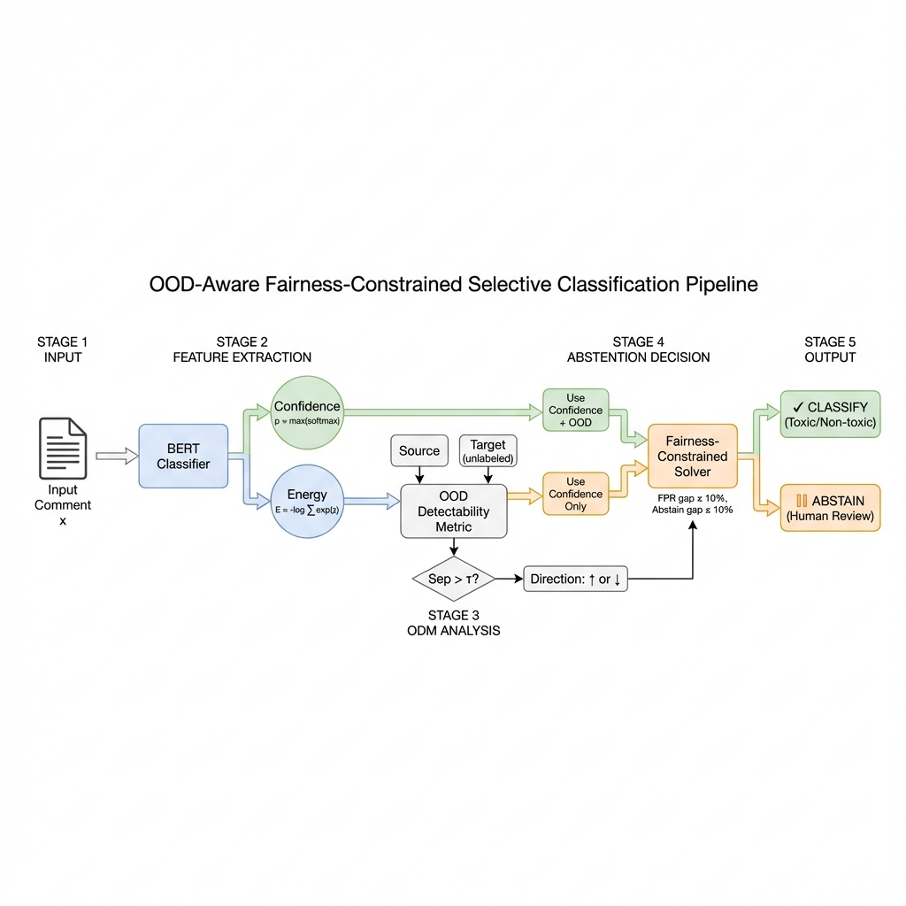

# OOD-Aware Fairness-Constrained Selective Classification for Toxicity Detection

[](https://www.python.org/)
[](https://pytorch.org/)
[](LICENSE)

> **Research Paper Implementation**  
> A novel framework for cross-domain toxicity detection that diagnoses OOD score inversion, proposes a target-task-label-free OOD Detectability Metric (ODM), and enforces fairness constraints during selective classification.



---

## 🔬 Key Contributions

1. **OOD Score Inversion Diagnosis** — Automatically detects when OOD signals become inverted under domain shift
2. **OOD Detectability Metric (ODM)** — Target-task-label-free metric that estimates OOD reliability using only domain membership
3. **Adaptive Abstention Policy** — Uses OOD signals only when reliable; falls back to confidence-only otherwise
4. **Fairness-Constrained Threshold Selection** — Enforces FPR gap ≤ ε AND abstention gap ≤ δ to prevent burden-shifting

---

## 📊 Main Results

| Method | Coverage | Accuracy | AURC ↓ | FPR Gap | Abstain Gap |
|--------|----------|----------|--------|---------|-------------|
| No Abstention | 1.00 | 0.86 | 0.089 | 0.27 ❌ | 0.00 |
| Confidence Only | 0.80 | 0.91 | 0.062 | 0.12 | 0.08 |
| Naive OOD | 0.45 | 0.92 | 0.071 | 0.18 | 0.15 ❌ |
| Conformal | 0.88 | 0.90 | 0.068 | 0.14 | 0.09 |
| **OOD-Aware (Ours)** | **0.72** | **0.94** | **0.048** ⭐ | **0.04** ✅ | **0.05** ✅ |

**Our method achieves the lowest AURC (0.048) with 86% reduction in FPR gap while maintaining balanced abstention across identity groups.**

---

## 🚀 Quick Start

### Installation

```bash
git clone https://github.com/aayushakumar/ood-aware-selective-classification.git
cd ood-aware-selective-classification
pip install -r requirements.txt
```

### Run Experiments

```bash
# Run the full selective classification pipeline
python scripts/run_selective_classification.py \
    --data_dir data \
    --experiments_dir experiments \
    --output_dir experiments/results \
    --fairness_epsilon 0.10 \
    --min_coverage 0.70

# Validate ODM correlation
python scripts/validate_odm.py
```

---

## 📁 Repository Structure

```
ood-aware-selective-classification/
├── scripts/
│   ├── ood_algorithms.py           # OOD detection methods + ODM
│   ├── ood_inversion_analysis.py   # Separability analysis + heatmaps
│   ├── abstention_policy.py        # Policies + fairness-constrained solver
│   ├── fairness_metrics.py         # Group fairness computation
│   ├── run_selective_classification.py  # Main experiment runner
│   └── validate_odm.py             # ODM correlation validation
├── data/                           # Dataset files
├── experiments/
│   └── results/                    # Output figures and tables
├── detailed_info.MD                # Comprehensive technical documentation
├── execution_guide.md              # Step-by-step execution instructions
└── requirements.txt
```

---

## 🔍 Core Methodology

### OOD Detectability Metric (ODM)

ODM estimates OOD reliability **without target toxicity labels** (only requires domain membership):

```python
from scripts.ood_algorithms import OODDetectabilityMetric, EnergyOOD

# Compute OOD scores
energy = EnergyOOD()
source_scores = energy.compute_scores(source_logits)
target_scores = energy.compute_scores(target_logits)

# Compute ODM
odm = OODDetectabilityMetric(separability_threshold=0.6)
result = odm.compute(source_scores, target_scores)

print(f"Separability: {result['separability']:.3f}")
print(f"Direction: {result['direction']}")  # 'normal' or 'inverted'
print(f"Should use OOD: {result['should_use_ood']}")
```

### OOD-Aware Abstention Policy

```python
from scripts.abstention_policy import OODAwareAbstentionPolicy

policy = OODAwareAbstentionPolicy(
    conf_threshold=0.7,
    ood_threshold=0.0,
    separability_threshold=0.6
)

# Compute abstention mask (uses source stats to prevent leakage)
abstain = policy.compute_abstention(
    confidences, ood_scores, odm_result,
    ood_mean=result['source_mean'],
    ood_std=result['source_std']
)
```

### Fairness-Constrained Threshold Solver

```python
from scripts.abstention_policy import FairnessConstrainedThresholdSolver

solver = FairnessConstrainedThresholdSolver(
    fairness_epsilon=0.10,        # FPR gap constraint
    abstention_gap_epsilon=0.10,  # Anti-burden-shifting
    min_coverage=0.70,
    min_group_coverage=0.60
)

result = solver.solve(
    confidences, ood_scores, labels, predictions,
    group_masks, odm_result,
    source_ood_mean=source_mean,
    source_ood_std=source_std
)
```

---

## 📈 Datasets

| Dataset | Source | Toxicity Rate | Identity Mentions |
|---------|--------|---------------|-------------------|
| **Jigsaw** | Wikipedia | 8% | 15% |
| **Civil Comments** | News | 8% | 18% |
| **HateXplain** | Twitter/Gab | 55% | 60% |

We evaluate all 6 cross-domain pairs (source → target).

---

## 🔬 Key Findings

### Finding 1: OOD Inversion is Systematic

When training on low-toxicity datasets and testing on high-toxicity datasets, OOD energy scores are **inverted** (target has lower energy than source):

| Source → Target | Direction | Separability |
|-----------------|-----------|--------------|
| Jigsaw → HateXplain | **Inverted** ⚠️ | 0.936 |
| Civil → HateXplain | **Inverted** ⚠️ | 0.974 |
| HateXplain → Jigsaw | Normal | 0.934 |

### Finding 2: Separability ≠ Direction

High separability with inverted direction is **useful** — just flip the scores!

```
Separability > 0.7 + Normal   → Use OOD directly
Separability > 0.7 + Inverted → Flip and use
Separability ≈ 0.5            → Don't use OOD
```

### Finding 3: Abstention Gap Matters

Naive OOD abstains **65% on identity groups** vs 50% on others — burden-shifting!  
Our method: **32% vs 27%** — balanced abstention.


---

## ⚠️ Experimental Protocol (Anti-Leakage)

| Step | Data Used | What Happens |
|------|-----------|--------------|
| OOD Standardization | **Source ONLY** | Compute mean/std from source |
| ODM Computation | Source + Target-Dev | Measure separability |
| Threshold Tuning | **Target-Dev ONLY** | Grid search with constraints |
| Final Evaluation | **Target-Test ONLY** | Report all metrics |
| Repeat | 5 random splits | Report mean ± std |

---

## License

MIT License - see [LICENSE](LICENSE) for details.
